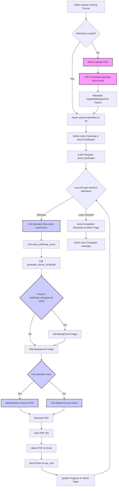

# Course Certificate Generator Process Flow

This document outlines the process flow for generating and emailing course certificates using the Course Certificate Generator plugin.

## Process Flow Diagram (Mermaid)

## Explanation

1.  **Course Selection & Attendee Loading:** The admin starts by selecting a training course. If attendees are already associated with the course, they are loaded into the dropdown.
2.  **CSV Upload (Optional):** If no attendees exist or the admin wants to update them, they can upload a CSV file. The file is processed, extracting `attendee`, `attendee_hours`, and `attendee_email_address`. The course's attendee list is updated.
3.  **Attendee Selection:** The admin chooses whether to generate certificates for 'All' attendees or a specific one.
4.  **Initiate Generation:** Clicking 'Generate & Send Certificates' triggers an AJAX request (`send_certificates`).
5.  **Backend Processing Loop:** The backend loops through each selected attendee.
6.  **Data Retrieval:** For the current attendee, their name, email, and `attendee_hours` (if available from the CSV upload) are retrieved.
7.  **Email & Certificate Generation:**
    *   The `send_certificate_email` function is called, passing the attendee's data, including `attendee_hours`.
    *   This function then calls `generate_course_certificate`, also passing `attendee_hours`.
    *   Inside `generate_course_certificate`:
        *   It checks if a `certificate_background` image URL exists for the course and adds it if present.
        *   It checks if `attendee_hours` was provided. If yes, it uses that value for the certificate; otherwise, it falls back to the default hours set for the course (`training_hours` ACF field).
        *   The PDF certificate is generated and saved to the uploads directory.
    *   `send_certificate_email` attaches the generated PDF and sends the email using `wp_mail`.
8.  **Progress Update:** The admin interface is updated via AJAX responses with the progress (number sent, current recipient).
9.  **Completion:** Once all selected attendees are processed, a final completion message is sent back to the admin page.